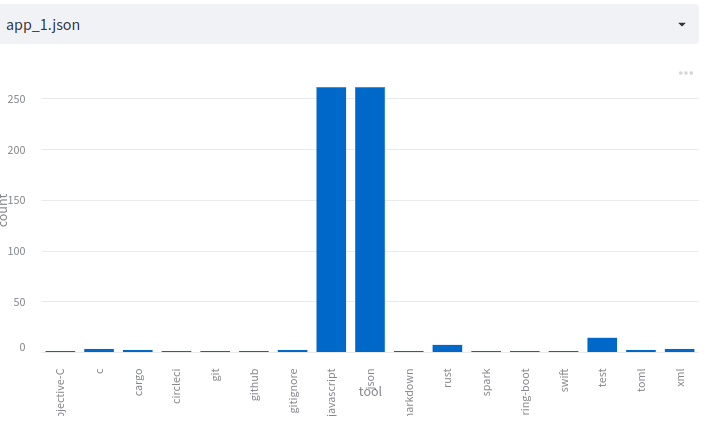

# glowing-happiness
Analyse the distribution of files and its content. Note that the order is not stable.

## building
### install rust
```bash
sudo apt update -y && sudo apt upgrade -y
sudo apt install curl build-essential gcc make -y
curl --proto '=https' --tlsv1.2 -sSf https://sh.rustup.rs | sh
```

### build project
```bash
cargo build
```


## usage
When running as binary directly, replace `cargo run -- ` with `glowing-happiness `  

### Input
Provide the input path of the directory / repository that you want to analyse.
This command will return a json with the tool distribution.
```bash
# when using the ready binary
cargo run -- --input .
```
Output: 

```json
{"c":3,"json":261,"spring-boot":1,"test":14,"rust":7,"python":2,"objective-c":1,"gitignore":2,"javascript":261,"circleci":1,"git":1,"xml":3,"toml":2,"swift":1,"cargo":2,"github":1,"markdown":1,"spark":1}
```

For Visualisation, see [Visualisation](README.md#Visualisation)

```bash
cargo run -- --input . --mode list
```

Returns only a distinct json list of tools used:
```json
["toml","gitignore","spark","json","test","github","c","cargo","javascript","rust","python","swift","git","spring-boot","markdown","objective-c","xml","circleci"]

```

# Snippet
To execute the application for several repositories, you can glue it with some python:
```python
import os
import subprocess
root = "."
for directory in os.listdir(root):
    subprocess.call(f"cargo run -- --input {os.path.join(root, directory)} > {directory}.json", shell=True)
```

Now you can visualize it.

# Visualisation
You can use the streamlit code in python to visualize the repositories.
Something like this may get you on the way.
```bash
cargo run -- --input . > app_1.json
python3 -m venv ./venv
. ./venv/bin/activate
pip3 install -r requirements.txt
streamlit run streamlit/app.py
```



In case you want a rust solution here, feel free to contribute. 

# Parallel Execution
The files will be analysed in parallel. To reduce the IO load on your device, you can set
`RAYON_NUM_THREADS=4` to only use 4 threads instead of all.
